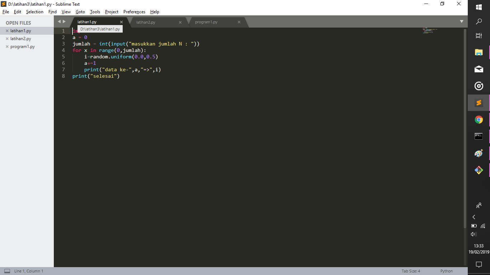
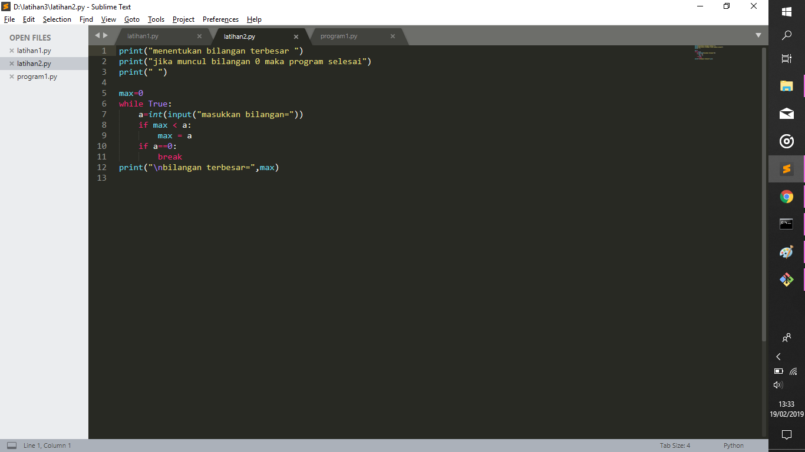
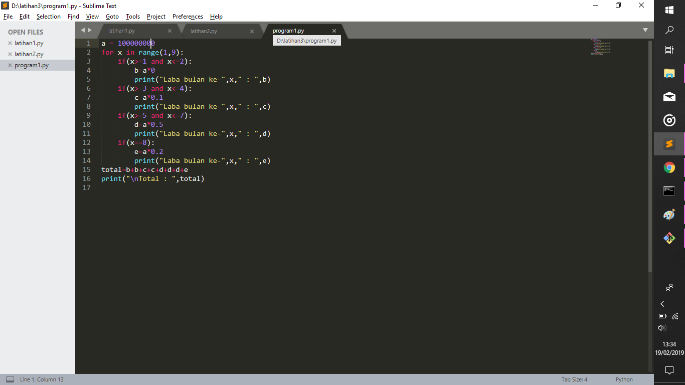

Mendefiniskan latihan 1, latihan 2, program 1.

>> Latihan 1 (bilangan acak)

penjelasan :

1. Import random digunakan untuk memasukkan modul random ke dalam program latihan 1

2. Pada line ke 3 user diminta memasukan bilangan yang mereka inginkan untuk mengisi nilai N

3. Line ke 5 merupakan fungsi for atau bisa dibilang fungsi perulangan. "For x in range(0,n)", X adalah index dari perulangan tersebut. Range(0,n) artinya dimulai dari 0 sampai N

4. Line ke 6 nilai "i" akan menampung bilangan secara acak diantara 0,0 sampai dengan 0,5

5. Untuk "a+=1" ini untuk penomoran nantinya

6. Untuk Line ke 8, akan menghasilkan l bilangan yang telah dipilih secara acak pada variabel "i" tadi

>> Latihan 2 (nilai terbesar)

Penjelasan :

1. Buat sebuah variabel penampung nilai maksimal

2. Perintah while true itu perintah yang di jalankan secara terus menerus sampai menemukan nilai False

3. Next, user akan di perintah untuk memasukkan nilai

4. Jika nilai max awal lebih kecil dari nilai B, maka nilai max akan menjadi nilai B yang sekarang 

5. Jika user memasukkan nilai B sama dengan 0, maka program akan terhenti

6. Yang terakhir program akan menampilkan nilai terbesar di antara banyaknya nilai yang di inputkan sebelumnya

>> Program 1

Penjelasan : 

1. Pertama akan masukkan modal awal 100.000.000 kedalam variabel A

2. Lakukan perulangan mulai dari angka 1 sampai dengan angka 9

3. Pada line ke 3, jika nilai x lebih dari sama dengan 1 Dan kurang dari sama dengan 2 maka menampilkan hasil dari laba bulan 1 dan 2. nilai B sebagai laba bulan ke1 dan ke 2

4. Pada line ke 6, jika nilai x lebih dari sama dengan 3 Dan kurang dari sama dengan 4 maka menampilkan hasil dari laba bulan 3 dan 4. nilai C sebagai laba bulan ke3 dan ke 4

5. Pada line ke 9, jika nilai x lebih dari sama dengan 5 Dan kurang dari sama dengan 7 maka menampilkan hasil dari laba bulan 5 sampai dengan bulan ke 7. nilai D sebagai laba bulan ke 5, ke 6, dan ke 7

6. Pada line ke 12, jika nilai x sama dengan 8 maka menampilkan hasil laba bulan 8. nilai E sebagai laba bulan ke 8

7. Nilai Total adalah nilai dari jumlah seluruh laba bulan ke1 sampai ke bulan ke 8

8. Terakhir menampilkan Total Laba